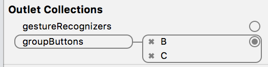

# IRRadioButton-iOS 

- IRRadioButton-iOS is a powerful radio button for iOS.
- Pretty simple class that extends standard UIButton functionality. Default and selected states can be configured for every button.

## Features
- Radio buttons

## Install
### Git
- Git clone this project.
- Copy this project into your own project.
- Add the .xcodeproj into you  project and link it as embed framework.
#### Options
- You can remove the `demo` and `ScreenShots` folder.

### Cocoapods
- Add `pod 'IRRadioButton-iOS'`  in the `Podfile`
- `pod install`

## Usage

### Basic
It does not need any central manager. Just link the buttons right in Interface Builder:


Alternatively group the buttons using single line of code:

```obj-c
radio1.groupButtons = @[radio1, radio2, radio3];
```

Select any button, and all other button in the same group become deselected automatically:

```obj-c
radio2.selected = YES; // radio1 and radio3 become deselected
```

Any button from the group knows which one is selected:

```obj-c
IRRadioButton* r1 = radio1.selectedButton;
IRRadioButton* r2 = radio2.selectedButton;
IRRadioButton* r3 = radio3.selectedButton;
NSAssert (r1==r2 && r2==r3, @"Must be equal");
```

And a helpful method to select button by tag:

```obj-c
[radio1 setSelectedWithTag:kTagRadio3];
```

## Screenshots


## Copyright
##### This project is inspired from [RadioButton-iOS](https://github.com/onegray/RadioButton-ios).

